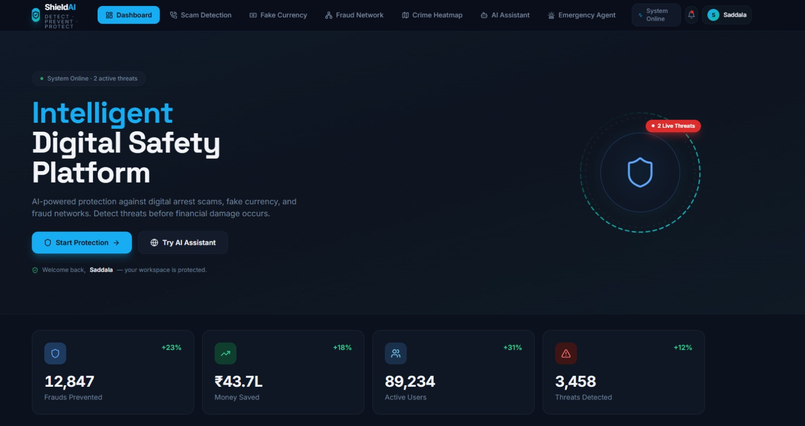
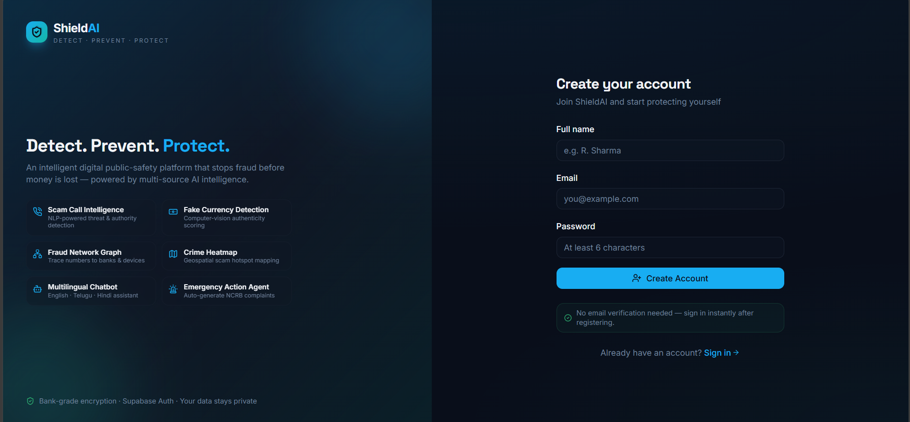
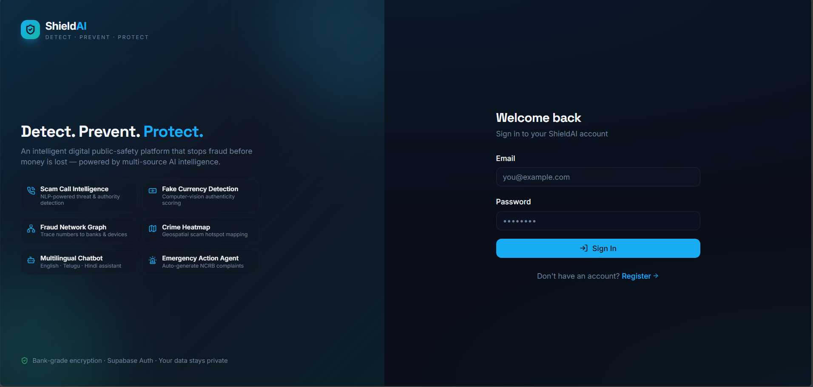
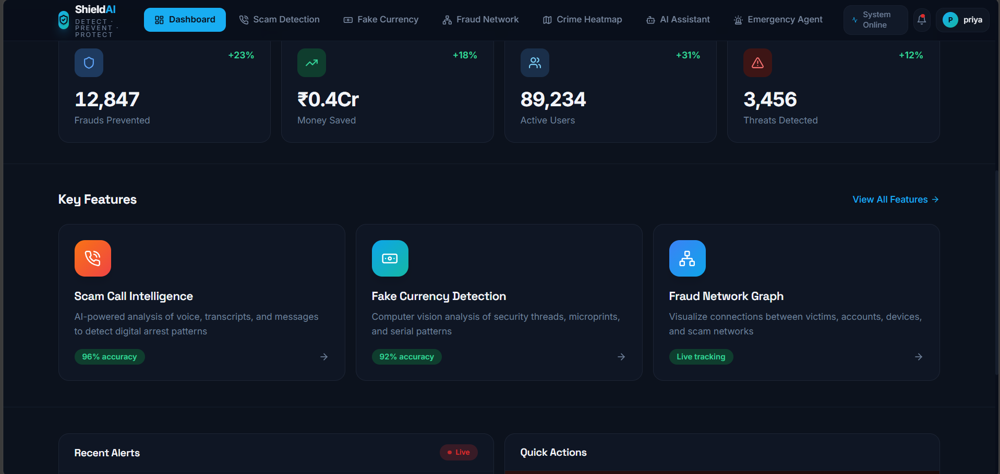
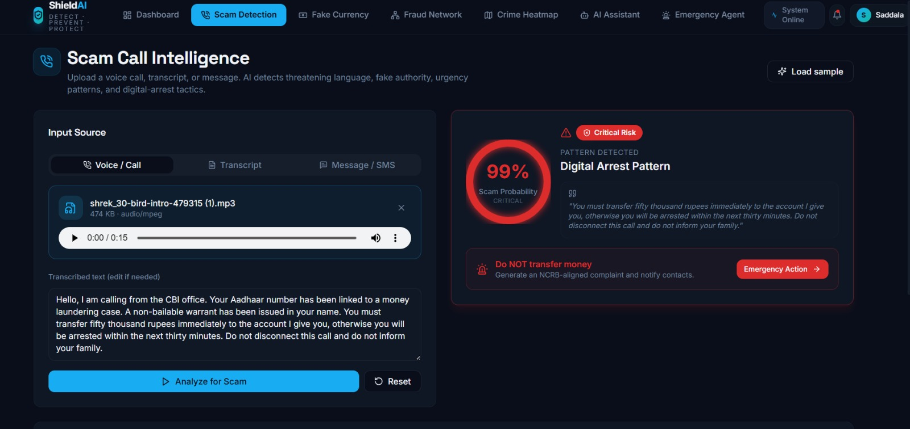
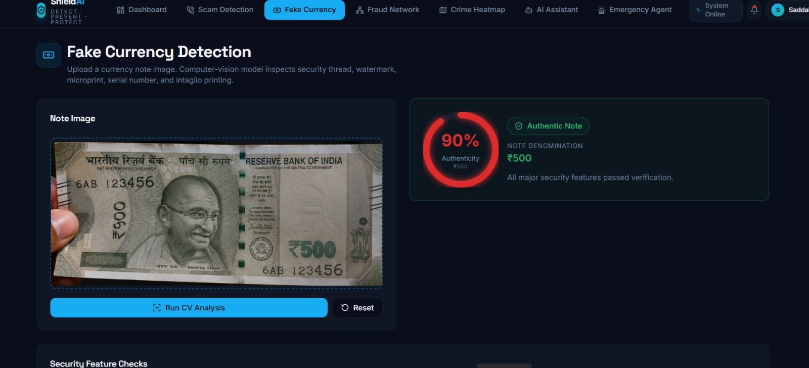
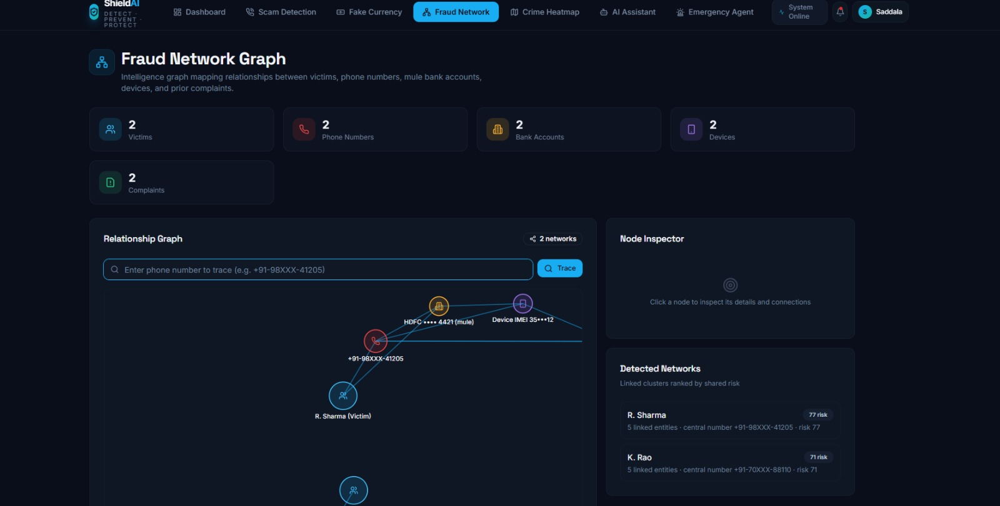
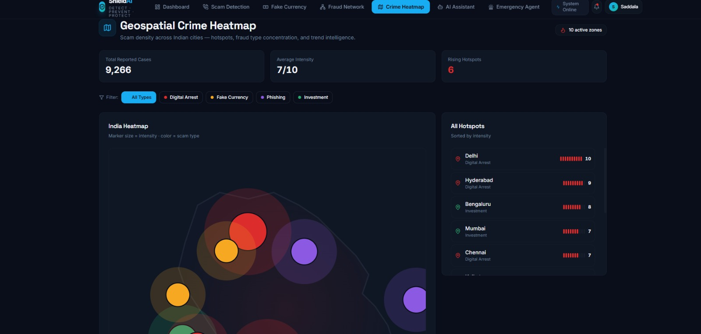
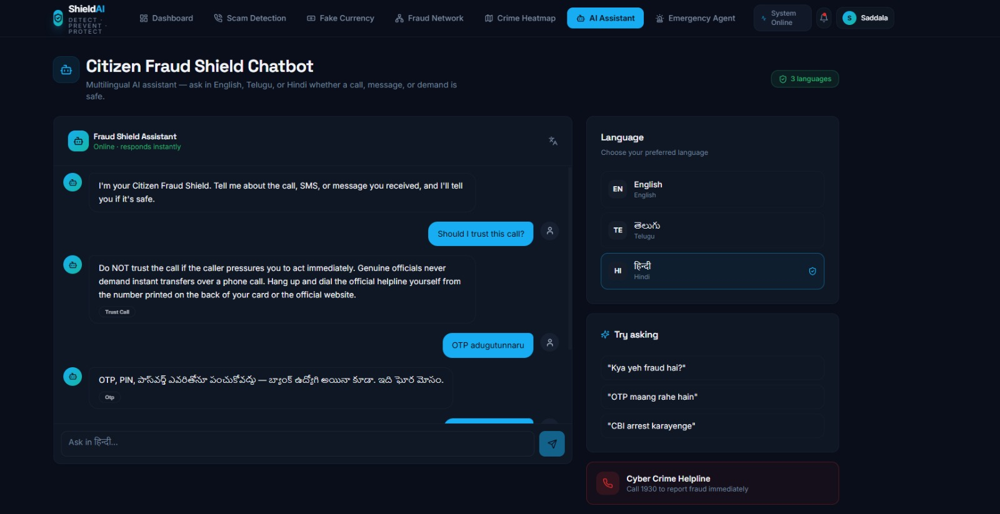
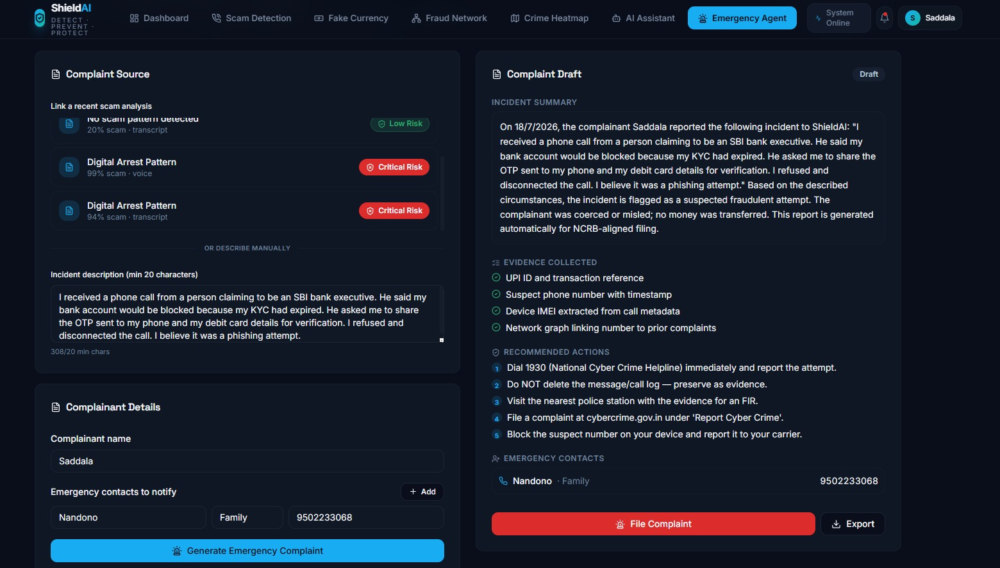

# 🛡️ ShieldAI – Intelligent Digital Public Safety Platform

<div align="center">

# Detect. Prevent. Protect.

### AI-Powered Cyber Fraud Prevention Platform

ShieldAI proactively detects cyber fraud using Artificial Intelligence before financial damage occurs.

---

### 🔗 Live Demo
https://shield-ai-oewg.vercel.app/

### 💻 GitHub Repository

https://github.com/SANIA-SAADU/shield-ai/

### 📄 Documentation

📘 [View Project Documentation](./docs/ShieldAI_Documentation.pdf)


---


</div>

---

# 📖 About ShieldAI

Cyber fraud has evolved rapidly, with scams such as digital arrests, fake government calls, phishing messages, counterfeit currency, and organized scam networks causing significant financial losses.

Most existing solutions investigate fraud **after victims lose money**.

**ShieldAI takes a preventive approach.**

Using Artificial Intelligence, Natural Language Processing, Computer Vision, Graph Analytics, and Machine Learning, ShieldAI analyzes suspicious content before financial damage occurs and assists users with immediate protective actions.

---

# 🚀 Key Features

## 🔐 Secure Authentication

* User Registration
* User Login
* Session Management
* Protected Dashboard
* Password Encryption
* Personalized Dashboard displaying logged-in user's name

---

## 📞 Scam Call Intelligence

Supports:

* Upload Voice Recording
* Record Live Audio
* Paste Call Transcript
* Paste Suspicious Message

Unified AI pipeline:

* Speech-to-Text
* NLP Analysis
* Scam Detection
* Threat Identification
* Fraud Risk Prediction
* AI Explainability
* AI Recommendations

Outputs:

* Fraud Risk Score
* Confidence Percentage
* Scam Category
* Threat Level

---

## 💵 Fake Currency Detection

Upload a currency image.

AI detects:

* Security Thread
* Microprinting
* Note Alignment
* Serial Number Pattern

Returns:

* Authenticity Score
* Counterfeit Probability
* AI Explanation

---

## 🕸️ Fraud Network Graph

Users can upload suspicious phone numbers.

The system visualizes relationships between:

* Phone Numbers
* Reported Fraud Cases
* Connected Devices
* Scam Networks

Future enhancement:

* Approximate geolocation analysis of reported numbers using publicly available information and user reports.

---

## 🗺️ Crime Heatmap

Displays:

* Scam Hotspots
* Fraud Density
* Counterfeit Activity
* Regional Risk Distribution

---

## 🤖 Citizen Fraud Shield Chatbot

Multilingual AI assistant supporting:

* English
* Telugu
* Hindi

Examples:

* "Should I trust this call?"
* "Is this message a scam?"
* "What should I do next?"

---

## 🚨 Emergency Action Center

After fraud detection:

* Generate Complaint
* Download AI Report
* Share Report
* Save Analysis History
* Display Emergency Guidance
* Support notifying saved emergency contacts (where configured)

---

## 📂 Analysis History

Automatically stores:

* Date
* Time
* Input Type
* Fraud Category
* Risk Score
* Confidence Score

---

# 🏗️ System Architecture

```text
                    User
                      │
                      ▼
               React Frontend
                      │
             Spring Boot REST APIs
                      │
        ┌─────────────┼─────────────┐
        ▼             ▼             ▼
 Speech-to-Text      NLP      Computer Vision
        │             │             │
        └─────────────┼─────────────┘
                      ▼
             AI Decision Engine
                      ▼
             Fraud Intelligence
                      ▼
                  MongoDB
                      ▼
          Dashboard • Reports • History
```

---

# ⚙️ Technology Stack

### Frontend

* React
* TypeScript
* Tailwind CSS
* Vite

### Backend

* Spring Boot
* Python Flask

### Database

* MongoDB

### AI Technologies

* Natural Language Processing
* Speech-to-Text
* Computer Vision
* Machine Learning
* Graph Analytics

---

# 🔄 Application Workflow

```text
Register
      │
      ▼
Login
      │
      ▼
Dashboard
      │
      ▼
Choose AI Module
      │
      ▼
Upload Voice / Image / Text
      │
      ▼
AI Analysis
      │
      ▼
Fraud Detection
      │
      ▼
Risk Report
      │
      ▼
Emergency Actions
```

---

# 📷 Application Screenshots

## Landing Page



---

## Register



---

## Login



---

## Dashboard



---

## Scam Call Intelligence



---

## Fake Currency Detection



---

## Fraud Network Graph



---

## Crime Heatmap



---

## AI Chatbot



---

## Emergency Action Center



---

# 📂 Project Structure

```text
ShieldAI/

├── frontend/
├── backend/
├── ai/
├── public/
├── images/
├── docs/
├── README.md
```

---

# ⚡ Installation

Clone the repository

```bash
git clone https://github.com/SANIA-SAADU/ShieldAI.git
```

Install dependencies

```bash
npm install
```

Run frontend

```bash
npm run dev
```

Run backend

```bash
mvn spring-boot:run
```

Run AI services

```bash
python app.py
```

---

# 🔒 Security

* Password Encryption (BCrypt)
* Secure Authentication
* Session Management
* Input Validation
* Protected APIs
* Secure Database Storage

---

# 🌍 Future Scope

* WhatsApp Scam Detection
* Email Fraud Detection
* QR Code Scam Detection
* Real-Time Call Monitoring
* Banking Fraud Integration
* Blockchain Complaint Tracking
* AI Voice Cloning Detection
* Predictive Fraud Intelligence

---

# 🏆 Hackathon Submission

**Project:** ShieldAI – Intelligent Digital Public Safety Platform

**Theme:** Artificial Intelligence for Public Safety & Cyber Fraud Prevention

---

# 👩‍💻 Developed By

**Saadu Sania**
**Saddala Nandini**


B.Tech – Computer Science & Engineering

Full Stack Developer | AI/ML Enthusiast

GitHub: https://github.com/SANIA-SAADU

LinkedIn:https://www.linkedin.com/in/sania-s-402604352/

---

# ⭐ Support

If you found this project interesting,

⭐ Star the repository

🍴 Fork it

💬 Share your feedback

---

<div align="center">

# 🛡️ ShieldAI

### Detect. Prevent. Protect.

Building safer digital communities through Artificial Intelligence.

</div>
